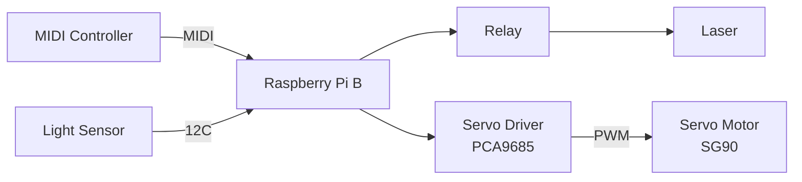

# 🔍 Overview
**Project L.U.M.E.N** is an experiental/exploratory initiative that invites you to re-awaken the "Temple of Lumen" using modern audio visual technology. The stations, or also known as **Shrines** includes:

1. Beam Circuit
2. Wall Glyphs Silent Sequence
3. Prism Cipher
4. Windle: The 5 Tone Cipher

In this repository, we will be focusing on **Station 1 - Beam Circuit**.

# ℹ️ Introduction to Beam Circuit
In this station, players are tested on not only their observation skills, but also their logical and reaction time as they need to avoid the light sensors that are placed along the border as well as the walls that block the laser path while adjusting the angle of the mirror for the it to reach the final light sensor placed in the center.

 **Raspberry Pi** and other components such as **Laser, Light Sensors, PCA9685 Servo Driver, MPD218 MIDI Pad and Servo Motors** are used to create a fun and interactive experience.

# 🛠️ Dependencies
All codes in this repository had been made using **Python 3.9 or higher**.

 The **Raspberry Pi** acts as the master, which then connects and controls the other elements:

 * [**Laser:**](https://github.com/Nixx-Goh/EGL314-Project-Lumen-Team-D/blob/main/Backlog%202%20Sprint%201/lasercontrol.py) To create a laser path for players to navigate through the maze

 * [**Light Sensors:**](https://github.com/Nixx-Goh/EGL314-Project-Lumen-Team-D/blob/main/Backlog%202%20Sprint%201/lightsensor.py) To detect laser path to determine success or failure
    
 * [**PCA9685 Servo Driver:**](https://github.com/Nixx-Goh/EGL314-Project-Lumen-Team-D/blob/main/Backlog%202%20Sprint%201/servomotorcontrol.py)
 To support Raspberry Pi to control the servo motor by using I²C 

  * [**Servo Motor:**](https://github.com/Nixx-Goh/EGL314-Project-Lumen-Team-D/blob/main/Backlog%202%20Sprint%201/servomotorcontrol.py)
 To have mirrors attached and serve laser path to reach destination

* [**MPD218 MIDI Pad:**](https://github.com/Nixx-Goh/EGL314-Project-Lumen-Team-D/blob/main/Backlog%202%20Sprint%201/midicontrol.py)
 To start game, end game, set servo motors to respective stages preset, and rotate respective motors to get desired angle

# ⚙️ System Flowchart 

# ⚙️ System Logic 

# 💻 Code Logic

