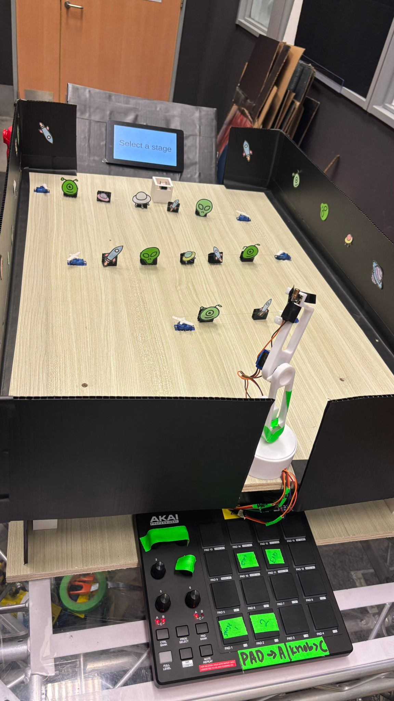
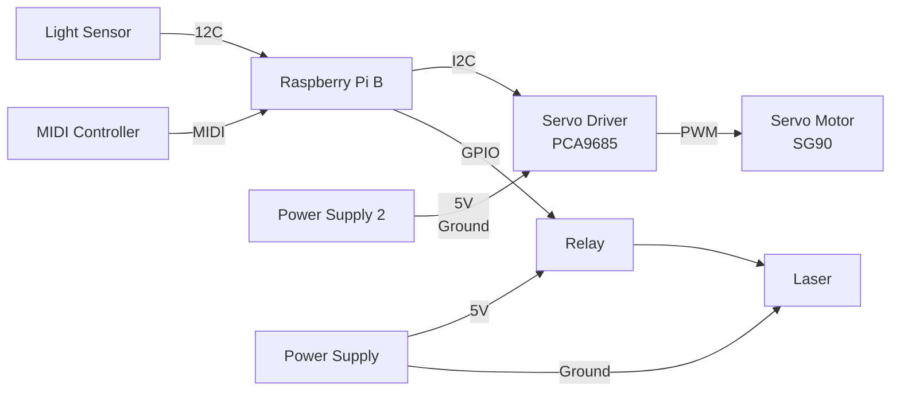

# 🔍 Overview
**Project L.U.M.E.N** takes place in Sector 536 - A cosmic frontier within NYP , named after the classroom where it all began. This project is inspired by Singapore's growing investment in space research and technology. Sector 536 invites guests to explore a series of immersive space stationed at the edge of the unknown, these are the 4 exhibits :

Station 1 - Laser Defence Protocol
Station 2 - Kinetic Core Recharge
Station 3 - Chromatic Defence Simulator
Station 4 - Launch Core Override

In this repository, we will be focusing on **Station 1 - Laser Defence Protocol**.

# ℹ️ Introduction to Laser Defence Protocol
 **Raspberry Pi** and other components such as **Laser, 2 Channel Relay, Light Sensors, PCA9685 Servo Driver, Servo Motors, MPD218 MIDI Pad, ADS1115 Analog Digital Converter (ADC) and Display Screen** are used to create a fun and interactive experience.

 In this exhibit, players are tested on their accuracy skills. As asteriods are shooting down, players are tasked to help us destroy them by aiming the laser into the light sensor. 
 
 There is a laser mounted onto a 3D printed robot arm where it stores 3 servo motors at different part of the arm and all will be controlled by the MIDI Pad on the right side of the board. Player will use 3 knobs on the MIDI Pad to control the rotation angles of the individual servo motors of the robot arm. Knob 5 controls the top servo motor where it goes up and down as well but for more accurate aim; Knob 6 controls the middle servo motor where the arm goes up and down; Knob 3 controls the bottom servo motor where it allows the arm to turn left and right. There will be 4 pads use as well, to select the 2 stages, start the game and end the game. 

 On the left side of the board, there are 2 light sensors stored in a 3D printed house as well as a display screen. In between the board, there are "space objects" taped onto a string where it is tied to the servo motors sweeping left and right to distract the players. Players are required to control the robot arm to shoot the laser into the light sensor while trying to not get distracted by the "space objects" within the time limit in order to consider it as a success.

 Here is an image of our game:

 


# 🛠️ Dependencies & System Logic
All codes in this repository had been made using **Python 3.9 or higher**.

 The **Raspberry Pi** acts as the master, which then connects and controls the other elements:

* [**Laser:**](https://github.com/Nixx-Goh/EGL314-Project-Lumen-Team-D/blob/main/Backlog%202%20Sprint%201/lasercontrol.py) To help players to destroy the asteriods

* **2 Channel Relay:** To control the laser 

* [**Servo Motor:**](https://github.com/Nixx-Goh/EGL314-Project-Lumen-Team-D/blob/main/Backlog%202%20Sprint%201/servomotorcontrol.py)
 To help "space objects" to sweep left and right and attached in robot arm to help aim the laser to the light sensor

* [**Light Sensors:**](https://github.com/Nixx-Goh/EGL314-Project-Lumen-Team-D/blob/main/Backlog%202%20Sprint%201/lightsensor.py) To detect laser and "destroy asteriods" to determine success or failure
    
* [**PCA9685 Servo Driver:**](https://github.com/Nixx-Goh/EGL314-Project-Lumen-Team-D/blob/main/Backlog%202%20Sprint%201/servomotorcontrol.py)
 To support Raspberry Pi to control the servo motor by using I²C 

* [**MPD218 MIDI Pad:**](https://github.com/Nixx-Goh/EGL314-Project-Lumen-Team-D/blob/main/Backlog%202%20Sprint%201/midicontrol.py)
 To start game, end game, set servo motors to respective stages preset, and rotate respective motors to get desired angle

 * **ADS1115 Analog Digital Converter (ADC):** To convert the light sensor from analog to digital

 * **Display Screen:** To display the time limit of each stage as well as success or failure

# ⚙️ System Flowchart 



# 💻 Code Logic
To enable I2C to control the servo motor via PCA9685, head to terminal and type 

```
sudo raspi-config
```
Select "Interface Option", select I2C, select enable and then exit and reboot
```
sudo reboot
```
After rebooting successfully, type these to get the address of the PCA9685 as well as the ADS1115
```
sudo apt install -y i2c-tools
```
```
i2cdetect -y 1
```

After successful detection, head over to the Visual Studio Code terminal and install these
```
pip install adafruit_pca9685
```
```
pip install board
```
```
pip install adafruit-circuitpython-motor
```
```
pip install adafruit_motor
```
```
pip install adafruit_ads1x15.ads1115.analog_in
```


To install adafruit on python interpreter: 

```
pip3 install adafruit-blinka
adafruit-circuitpython-pca9685
adafruit-circuitpython-servokit
```

Run the programme to check if ^ these have been installed successfully. If it was not installed successfully, there would be red underline stating that library was not installed successfully, just install again. 


